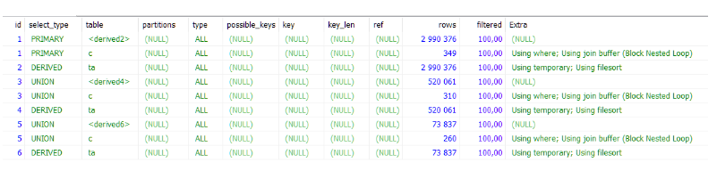

# [Вопросы из теста Python-разработчик (сложный)](https://portal.dke.moscow/)

_Всего было 100 вопросов и давалось 90 минут._

## Cодержание:

* [Python](#Python)
* [Django](#Django)
* [Kubernetes and Docker](#kubernetes--docker)
* [Базы данных](#базы-данных)
* [UI/UX design](#uiux-интерфейсы)
* [Cети(IP, TCP, HTTP, etc.)](#сети-ip-http-tcp-etc)
* [CSS/JS](#cssjsdom)
* [Рефактринг, оптимзация](#рефактринг-оптимзация)

## Python
[[вверх]](#Cодержание)
### 1. Какой будет результат выполнения следующего года?

```
class First:
    def __init__(self):
        self.multiply(15)
        print(self.i)
    def multiply(self, i):
        self.i = 4 * i

    
class Second(First):
    def __init__(self):
        super().__init__()
    def multiply(self, i):
        self.i = 2 * i

obj = Second()
```

1. [ ] 15
2. [ ] 60
3. [ ] Будет выброшено исключение
4. [x] 30

### 2. Каков будет результат выполнения Python-кода?

```
x = ['ab', 'cd', 'ef']
print(list(map(list, x)))
```

1. [ ] Будет напечатано: `[['ab'], ['cd'], ['ef']]`
2. [ ] Будет напечатано: `[['ab'], ['cd'], ['ef']]`
3. [ ] Каждой элемент из х будет "обернут" списком
4. [x] Каждой элемент из х будет преобразован списком
5. [ ] Ошибка NameError, так как функция map объявлена
6. [ ] Ошибка TypeError, так как функция list,
   переданная аргументом в map, не вызывается

### 3. Выберите все варианты с некорректным синтаксисом создания множества на языке Python

1. [ ] `set[[1, 2], [3, 4], [5, 6]]`
2. [ ] `set([1, 2, 3, 4, 5, 6])`
3. [x] `{[1, 2, 3, 4, 5]}`
4. [x] `{[1, 1, 1, 1, 1]}`
5. [ ] `{1, 2, 3, 4}`
6. [ ] `set((1, 2, 3, 4))`
7. [x] `{{1, 1, 1, 1, 1}}`

### 4. Выберите выражения, которые являются некорректными на языке Python:

```
xyz = 1,000,000
x y z = 1000 2000 3000 4000
x, y, z = 1000, 2000, 3000
x_y_z = 1,000,000
x_y_z = 1-000-000
```

1. [ ] 1
2. [x] 2
3. [ ] 3
4. [ ] 4
5. [ ] 5
6. [ ] Все выражения корректны

### 5. Что произойдёт после выполнения следующего Python-кода?

```
d = 7

def simple(a=3, b, c):
   global d
   print(a, b, c, d)
```

1. [ ] Будет напечатано: 4 5 6 7
2. [ ] Будет напечатано: 4, 5, 6, 7
3. [ ] NameError, т.к. переданная d не указана при объявлении функции simple
4. [x] SyntaxError
5. [ ] Будет напечатано: 3 5 6 7
6. [ ] Будет напечатано: 3, 5, 6, 7
7. [ ] IndexError так как элементов начиная с 5-го нет в листе

### 6. Что будет напечатано в результате выполнения Python-кода?

```
lst = [[]] * 5
print(lst)
lst[0].append(10)
print(lst)
lst[1].append(20)
print(lst)
lst[2].append(30)
print(lst)
```

1. [ ] 
2. [ ] 
3. [ ] 
4. [ ] 

### 7. Выберите варианты, описывающие простое и глубокое копирование в Python.

1. [ ] Для простого копирования объектов, скажем, словаря, достаточно вызвать его метод сору,
   например:

``` 
obj a = (1: 1, 2: 'a", 'c': [3, 'e')} 
obj_b = obj_a.copy() 
```

2. [ ] Для простого копирования можно воспользоваться методом сору.соpу()
3. [ ] Поверхностное копирование подразумевает, что копируется только самый верхний уровень объекта, без его глубоких
   атрибутов, т. е. для объекта obj_a скопируется только `{1: 1, 2: 'a'}`
4. [ ] Поверхностное копирование подразумевает только создание новых ссылок на имеющиеся объекты,
   а не копирование значений
5. [ ] Глубокое копирование копирует в т. ч. атрибуты со вложенными объектами
6. [ ] Глубокое копирование подразумевает создание копии всего содержания объекта не по ссылкам, а
   по его значениям

### 8.Представьте ситуацию, когда ваша программа работает безостановочно в режиме сервера, отвечая на пользовательские запросы. Часть обращений обрабатывается модулем (допустим, он называется coolApi), который вы импортировали при запуске сервера и который получен вами от сторонней команды разработчиков. Через какоето время команда обновила модуль, добавив туда несколько новых обработчиков. Можно ли было предусмотреть эту ситуацию средствами python, чтобы без остановки сервера и переписывания кода вашей программы, ваш сервер начал обрабатывать новые виды запросов? Например, для этой цели была настроена периодическая задача в event loop'е, которая будет вызывать следующий код:

1. [ ] Можно использовать такой код: `import coolApi`
2. [ ] Можно использовать такой код: `reload coolApi`
3. [ ] Можно использовать такой код: `import sys `
4. [ ] 
       ``` 
       if 'coolApi' in sys.modules: 
              del sys.modules['coolApi']
                 import coolApi
       ```

### 9. Для чего в языке Python используются так называемые «слабые» ссылки и где они описаны?

1. [ ] Используют для создания неявной модели документа при веб-разработке
2. [ ] «Слабые» ссылки позволяют получать доступ к объекту, в отличие от «сильных»
3. [ ] «Слабые» ссылки позволяют получать доступ к объекту, как и «сильные» ссылки
4. [ ] Сборщик мусора (gc) обязательно удалит объект даже при наличии на него «слабой» ссылки, если «сильных» ссылок на
   него не осталось
5. [ ] Сборщик мусора (gc) не удалит объект, если на него есть хотя бы одна ссылка, в т. ч. «слабая»
6. [ ] Модуль weekref отвечает за манипуляции со «слабыми» ссылками
7. [ ] Методы класса weekref в модуле gc отвечают за манипуляции со «слабыми» ссылками

### 10. Какими способами можно инициировать запуск подпроцесса или внешней программы из python-скрипта?

* [ ] Python использует GIL (Global Interpretator Lock), который запрещает такие действия
* [ ] Решение задачи может выглядеть, например, так: import subprocess subprocess.call(['telnet', ' ya.ru ', '-6'])
* [ ] Решение может выглядеть так: import subprocess arglist=['telnet', ' ya.ru ', '-6'] subprocess.Popen(arglist,
  stdout=outputfile)
* [ ] Решение возможно, используя методы библиотеки `threading`
* [ ] Решение возможно, используя методы библиотеки `os`
* [ ] Решение возможно, используя методы модуля `multiprocessing`

### 11. Рассмотрите запрос, сформулированный на языке Python: response = requests.get('https:api.github.com'). Какие методы библиотеки requests о содержании ответа на указанный выше запрос определены верно?

* [ ] response.text возвращает содержание ответа как объект bytes
* [ ] response.json возвращает содержание ответа как объект json
* [ ] response.json() возвращает содержание ответа как объект json
* [ ] response.content возвращает содержание ответа как объект bytes
* [ ] response.content возвращает содержание ответа как объект string
* [ ] response.text возвращает содержание ответа как объект string

### 12. Выберите варианты, которые предоставляет Python для доступа к байткоду программ

* [ ] Для хотя бы единожды выполненных программ в процессе транслирования интерпретатором кода к виду, доступному для
  виртуальный машины python, создаются специальные файлы, в которых хранится/кэшируется такой код (. рус), что позволяет
  программе в дальнейшем быстрее исполняться
* [ ] С помощью атрибутов метода `＿code＿` доступного укаждой функции, можно получить данные о скомпилированном объекте,
  в частности, инструкции виртуальной машины, константы и переменные, используемые объектом
* [ ] Для инспектирования байткода предназначен модуль dis, методы которого дают возможность инспектировать выполняемые
  «под капотом» python-кода низкуровневые инструкции и передаваемые в них значения
* [ ] Для инспектирования байткода предназначен модуль inspect, методы которого дают возможность инспектировать
  выполняемые «под капотом» python-кода низкуровневые инструкции и передаваемые в них значения

### 13. Что такое контекстный менеджер в Python и зачем он нужен?

* [ ] Специальный метод `＿context＿` хранит текущие переменные блока исполнения программы
* [ ] Специальный класс, в котором объявлены методы `＿enter＿` и `＿exit＿`
* [ ] Способ управлять областью видимости переменных
* [ ] Дает возможность выполнять определённый код до входа в блок with и после выхода из него

### 14. Выберите утверждения, касающиеся создания метакласса в языке Python

* [ ] Для создания своего метакласса нужно воспользоваться подклассом type, стандартным метаклассом в python
* [ ] Чаще всего метаклассы используются в роли виртуального конструктора
* [ ] Метаклассы определяются с помощью базовых классов в атрибуте `__metaclass__`
* [ ] Во время выполнения оператора class генерируется пространство имен, которое будет содержать атрибуты будущего
  класса, после чего, для непосредственного создания, вызывается метакласс с
  именем и атрибутами
* [ ] Для создания метакласса нужно воспользоваться ключевым словом `super`

### 15. В чём смысл нотаций `_value`, `＿value `в языке Python?

* [ ] Одно лидирующее подчёркивание перед названием атрибута обеспечивает ограничение, что его можно использоваться
  только внутри класса. При этом он становится недоступным извне.
* [ ] Одно лидирующее подчёркивание перед названием атрибута предлагает считать параметр используемым внутри класса,
  однако он всё ещё доступен извне.
* [ ] Поля с двойным подчёркиванием доступны изнутри класса, но недоступны извне по такому же имени.
* [ ] Поля с двойным подчёркиванием всё же доступны по имени вида `_<ClassName>__<fieldName>`

### 16. Что такое магические методы в Python и для чего они нужны?

* [ ] Методы, производящие необъяснимые, но полезные действия над объектами
* [ ] Методы, имена которых всегда начинаются на одинарное подчёркивание
* [ ] Имена этих методов начинаются и заканчиваются на двойные подчёркивания
* [ ] Методы с неявным вызовом
* [ ] Методы вызываются синтаксическими конструкциями и встроенными функциями

### 17. Какой будет результат выполнения следующего python-кода?

* [ ] `object() == object()`
* [ ] `True`
* [ ] `False`
* [ ] `Undefined`
* [ ] `NaN`

### 18. Можно ли в классе сослаться на родительский класс?

* [ ] Синтаксис языка не позволяет этого сделать напрямую. Можно создать экземпляр класса и передать его в переменной.
* [ ] Можно воспользоваться методом `＿class＿()`.
* [x] Следует обратиться к методу `super()`.
* [ ] Следует обратиться к методу `＿main＿()`.

### 19. Каким способом нельзя корректно посчитать факториал числа n>0 на языке Python?

* [ ] ```
      import math 
      math.factorial(n)
* [ ] ```
      def factorial(n): return [base if base == 1 else base*i for i in range(n, 0, -1)][0]
* [ ] ```
      def factorial(n): 
          if n == 1: 
              return n 
          else:
              return n*factorial(n-1)
* [ ] ```
      def factorial(n): 
          base = 1 
          for i in range(n, 0, -1): 
              base = base * i 
          return base

* [ ] ``` 
      deffactorial(n, total=1): 
          while True: ifn == 1: 
             return total 
          n, total = n - 1, total * n

### 20. Какие способы представления графов описаны верно?

* [ ] Для матрицы смежности для каждой вершины мы храним список всех вершин графа и признак того, существует ли с ними
  связь
* [ ] Для списков смежности каждой вершине графа соответствует список, состоящий из соседних вершин этой вершины
* [ ] Список рёбер - это список, где каждому ребру графа соответствует строка, в которой хранятся две вершины,
  инцидентные ребру
* [ ] Для графа из паросочетаний храним зависимое множество попарно смежных рёбер, имеющих общие вершины
* [ ] Матрица инцидентности - это таблица, где строки соответствуют вершинам графа, а столбцы - связям (рёбрам) графа

### 21. Какой алгоритм реализован в python-коде?

```
def print_directory_contents(sPath): 
   import os 
   for sChild in os. listdir(sPath): 
      sChildPath = os.path.join(sPath,sChild) 
      if os.path.isdir(sChildPath):
         print_directory_contents(sChildPath)
      else:
         print(sChildPath)
```

* [ ] Обход двоичного дерева папок
* [ ] Обход декартова дерева папок
* [ ] Обход Т-дерева папок
* [ ] Рекурсивный обход дерева

### 22. Какие реализации стека встречаются в стандартной библиотеке Python?

* [ ] Список может использоваться как стековая структура данных
* [ ] `collections.deque` может использоваться как стек
* [ ] Словарь можно использовать как стек
* [ ] Множество используют как стек

### 23. Какой алгоритм реализует следующая функция на языке Python?

```
def search(array, target):
   lower = 0 
   upper = len(array) 
   while lower < upper:    
      x = lower + (upper - lower) // 2 val = array[x] 
      if target == val: 
         return x 
      elif target > val: 
         if lower == x:
            break
         lower = x 
      elif target < val:
         upper = x
```

* [ ] Линейный поиск
* [ ] Бинарный поиск
* [ ] Поиск вставкой

### 24.Какая временная сложность у представленного кода на языке Python?

```
imin = 0 
imax = 0 
for i in range(size):
   if array[i] < array[imin]: 
      imin = i 
   elif array[i] > array[imax]: 
      imax = i
```

* [ ] O(n log n)
* [ ] O(log n)
* [ ] O(n)
* [ ] O(n2)

### 26. Что из перечисленного неверно?

* [ ] Можно использовать переменную `＿all＿` в `＿init＿ ру`, чтобы указать, что будет импортировано
  выражением `from <модуль> import *`
* [ ] Команда `from <модуль> import *` не импортирует имена из модуля, которые начинаются с нижнего подчеркивания _
* [ ] Команда `from <модуль> import * as` end позволяет импортировать всё из модуля <модуль> в пространство имён end
* [ ] Можно использовать `if ＿name＿ == '＿main＿'` для проверки, был ли скрипт импортирован или
  запущен напрямую
* [ ] Можно установить проект в качестве пакета (в режиме разработчика) с помощью `pip install -e <проект>`,
  чтобы добавить корень проекта в `sys.path`

### 27. Что означают следующие записи в `requirements.txt` в контексте использования Python?

`requests ==2.21 gunicorn >16.0, !=19.5.1, <22.0`

* [ ] Выражения синтаксически некорректны
* [ ] Нужно сравнить переменную requests со значением 2.21, а переменную gunicorn - итеративно с
  каждым условием
* [ ] Установить пакет requests версии 2.21, а пакет gunicorn - любой, доступный в репозитории, версия которого больше
  16.0, меньше 22.0 и отличается от 19.5.1
* [ ] В выражениях запрашивается установка пакетов, но только первое выражение верно сформулировано синтаксически,
  второе следует переписать

### 28. Какие задачи не решает размещение программ в пакеты, доступные через рip?

* [ ] Переиспользование кода
* [ ] Возможность поддерживать в актуальном состоянии каждый пакет отдельно
* [ ] Возможность поделиться своей разработкой с другими
* [ ] Объединение классов и методов в файл для удобного импорта в проект
* [ ] Управление сложностью в программном проекте за счёт его декомпозиции на «физическом» уровне
=======

*to-do: 
(добавить вопросы по Python)
(добавить содержание)
(разобрать вопросы)
>>>>>>> parent of 2d73514 (Update README.md)

## Django
[[вверх]](#Cодержание)

### 31. Какие разновидности типов полей в моделях недоступны в Django?

1. [ ] CharField используется для определения строк фиксированной длины
2. [ ] TextField используется для больших строк произвольной длины
3. [ ] IntegerField - это поле для хранения значений (целого числа) и проверки введенных значений в
   виде целых чисел в формах
4. [ ] DateField и DateTimeField используются для хранения/представления дат и информации о дате/
   времени
5. [ ] EmailField используется для хранения и проверки адресов электронной почты
6. [ ] FileField и ImageField используются для загрузки файлов и изображений

### 32. Как в шаблонах Django получить текущие разрешения, предоставленные пользователю?

1. [ ] По умолчанию такой возможности не предоставляется, нужно реализовывать самостоятельно, прокидывая переменную в
   шаблон
2. [ ] Нужно использовать {perms}}
3. [ ] Нужно использовать {{ permissions }}
4. [ ] Разрешения доступны и через {{ perms }} и через {{ permissions }}

### 33. Авторизация в Django?

1. [ ] Это группировка пользователей по видам действий, которые им позволено совершать в системе
2. [ ] Это проверка наличия сущности/пользователя в контексте Django
3. [ ] Это шаг после аутентификации, во время которого устанавливаются права пользователя,
   т.е. определяются действия, которые может выполнять аутентифированный пользователь.
4. [ ] авторизация реализована во встроенном приложени django.contrib.auth

### 34. Когда мы выполняем form.clean() в Django для объекта формы, то предполагаем, что в любой момент валидатор может инициировать ошибку валидации. Что происходит после ошибки валидации?

1. [ ] Программа останавливается, и сервер Django останавливается
2. [ ] Метод clean() останавливает проверку и возвращает список ошибок проверки
3. [ ] Метод clean() продолжает выполнение и отлавливает все ошибки проверки в этой форме
4. [ ] Метод clean() отлавливает ошибку проверки и исправляет ее

### 35. Как происходит обратное разрешение url в Django, позволяющее избежать жесткого кодирования ссылок?

1. [ ] Обратное разрешение url в шаблонах достигается через использование тега url
2. [ ] Обратное разрешение url в шаблонах достигается через использование тега reverse
3. [ ] Обратное разрешение url в python-коде / представлениях Django может быть достигнуто через вызов
   метода reverse()
4. [ ] Обратное разрешение url в ряде классов высокоуровневых моделей достигается с помощью метода get_absolute_uri()

### 36. Как включается и работает CSRF-защита форм в Django?

1. [ ] CSRF middleware по умолчанию отключена в настройках Django
2. [ ] Промежуточный слой (middleware) django.middleware.csrf.CsrfViewMiddleware должен быть
   определён до любого другого промежуточного слоя, который хочет его использовать
3. [ ] В шаблоне формы нужно добавить тег 
4. [ ] Во время рендеринга страницы Django генерирует уникальный для пользователя/браузера
   токен и отклоняет все формы, которые не содержат его или содержат его неверное значение

## Kubernetes & Docker
[[вверх]](#Cодержание)
### 37. Что является основными объектами ядра kubernetes?

1. [ ] Поды/модули
2. [ ] Cервисы
3. [ ] Тома (Volumes)
4. [ ] Приложения (applications)

### 38. Где хранятся данные кластера kubernetes?

1. [ ] Kube-apiserver
2. [ ] Kubelet
3. [ ] Etcd
4. [ ] Pods

### 39. В чём суть инструкций ENTRYPOINT и CMD, используемых в Docker, и как ими пользоваться?

1. [ ] B Dockerfile нужно определить и ENTRYPOINT, и CMD
2. [ ] В Dockerfile достаточно определить только одну из инструкций
3. [ ] Флаг командной строки - entrypoint может быть использован, чтобы переопределить инструкцию
   entrypoint
4. [ ] CMD указывает команду и аргументы для выполнения
   внутри контейнера, используемые по умолчанию, которые впоследствии могут быть переопределены

### 40. Выберите корректно описанные инструкции, используемые при создании Dockefile

1. [ ] WORKDIR устанавливает рабочую директорию для инструкций CMD и RUN
2. [ ] ARG определяет переменную для передачи Docker-контейнеру во время сборки
3. [ ] CОPY копирует файлы и директории из контейнера
4. [ ] WORKDIR устанавливает рабочую директорию для инструкций CMD и ENTRYPOINT
6. [ ] EXPOSE открывает порт
7. [ ] FROM задаёт главный (родительский) образ
8. [ ] Dockerfile обязательно должен начинаться с переменной ARG
9. [ ] Команда CMD выполняется не во время построения образа, а во время запуска контейнера

### 41. Какой open source формат используется в docker compose файлах?

1. [x] json
2. [ ] yaml
3. [ ] xml
4. [ ] markdown

### 42. Рассмотрим пространства имён, сконфигурированные по умолчанию в kubernetes:

```
$ kubectl get namespaces

NAME        STATUS      AGE
default     active      7h
docker      active      7h
kube-public active      7h
kube-system active      7h
```

namespaces хорошо изолируют ресурсы внутри класса.
В каком из четырёх пространств имён размещаются контейнеры, используемые
для запуска Kubernetes и включения поддержки в Docker?

1. [ ] default
2. [ ] docker
3. [ ] kube-public
4. [ ] kube-system

## Базы данных
[[вверх]](#Cодержание)
### 43. В базе данных созданы 2 таблицы:

```
CREATE TABLE T1 (
x INT
); 
INSERT INTO T1 (x) VALUES (1); 
INSERT INTO T1 (x) VALUES (2);

CREATE TABLE T2 (
xint
INSERT INTO T2 (x) VALUES (2); 
INSERT INTO T2 (x) VALUES (3);```
``` 

**Какие запросы вернут таблицу следующего содержания**

```
x
3
```

* [ ]  SELECT T2.x FROM T1 RIGHT JOIN T2 ON T1.x = T2.x
* [ ] SELECT T2.x FROM T1 LEFT JOIN T2 ON T1.x = T2.x WHERE T1.x IS NULL
* [ ] SELECT T2.x FROM T1 RIGHT JOIN T2 ON T1.x = T2.x WHERE T2.x > 2
* [ ] SELECT T2.x FROM T1 RIGHT JOIN T2 ON T1.x = T2.x WHERE T1.x IS NULL

### 44.Выберите SQL-утверждения, эквивалентные следующему:

`SELECT name FROM client WHERE state = 'MB`

* [ ] SELECT name FROM client WHERE NOT state NOT IN ("MB');
* [ ] SELECT name IN client WHERE state = "MB"
* [ ] SELECT name IN client WHERE state = "M'
* [ ] SELECT name FROM client WHERE state IN ("MB')
* [ ] SELECT name IN client WHERE state IN ("MB')

### 45. Нужно выполнить соединение четырех таблиц А, В, С и D. Таблицы А и В соединяются по столбцу F1, таблицы В и С - по столбцу F2, таблицы С и D - по столбцу F3. Кроме того, в результате необходимо оставить только строки со значением F1 равным 10. Сколько всего операторов сравнения будет записано в `WHERE`и `ON`?

* [ ] 2
* [ ] 3
* [ ] 1
* [ ] 4

### 46. В каких случаях нельзя использовать подзапросы в SQL, возвращающие больше одной строки?

* [ ] Внутри операторов IN, EXISTS, NOT IN
* [ ] Внутри операторов BETWEEN, LIKE, =
* [ ] Внутри операторов CREATE, INSERT, UPDATE
* [ ] Внутри пользовательских функций
* [ ] Внутри хранимых процедур

### 47. Параллельно происходящие транзакции в СУБД могут приводить к рассогласованию данных. Возникновение каких феноменов характерно на разных уровнях изоляции транзакций?

* [ ] На уровне изоляции транзакций READ COMMITED могут возникать феномены DIRTY READ, LOST UPDATE
* [ ] На уровне изоляции транзакций REPEATABLE READ возможно возникновение феноменов LOST UPDATE и PHANTOM READ
* [ ] На уровне изоляции транзакций SERIALIZABLE невозможно возникновение ни одного из феноменов: LOST UPDATE,
  UNREPEATABLE READ, PHANTOM READ, DIRTY READ
* [ ] На уровне изоляции транзакций REPEATABLE READ могут возникать феномены PHANTOM READ, LOST UPDATE

### 48. Что представлено на рисунке в контексте выполнения SQL запросов (MySQL)?



* [ ] Схема организации базы данных
* [ ] План выполнения запроса
* [ ] Описание возможных типов действий в разных таблицах
* [ ] Описание хранимой процедуры
* [ ] Граф вычислений для базы данных

### 49. Выберите все верные следствия САР-теоремы

* [ ] Система класса СР способна функционировать в условиях распада, но достигает этого в ущерб доступности: может не
  выдавать отклик на запрос
* [ ] Система класса СР предполагает, что обеспечения устойчивости к распаду на секции требуется обеспечение
  дублирования изменений во всех узлах системы
* [ ] Системы класса САР предполагают, что выполняются сразу 3 условия:
    - в каждом узле одномоментно данные не противоречат друг другу
    - любой запрос к распределённой системе завершается корректным идентичным откликом каждого
      узла
    - каждая из секций, на которые расщепилась распределённая система, даёт корректные ответы
* [ ] АР-системы предполагают, что в отсутствии изменений данных, через какой-то промежуток времени после последнего
  обновления (в конечном счёте) все запросы будут возвращать последнее обновлённое значение

### 50. Какие выделяют типы временных ограничений доступа к данным, участвующим в транзакции, со стороны других транзакций?

* [ ] Разделяемые блокировки
* [ ] Исключающие блокировки
* [ ] Явные блокировки
* [ ] Фантомные ограничения
* [ ] Строчные блокировки

### 52. Ситуация в СУБД, при которой несколько процессов находятся в состоянии ожидания ресурсов, занятых друг другом, и ни один из них не может продолжать свое выполнение, называется:

* [ ] захватом ресурса
* [ ] состоянием гонки
* [ ] взаимной блокировкой
* [ ] инверсией приоритетов
* [ ] livelock

### 53. Какое требование ACID может быть охарактеризовано утверждениями:

* ссылочная целостность;
* указание того, какие значения могут принимать атрибуты узлов;
* указание того, какие связи могут устанавливаться между узлами;
* указание того, каково минимальное и максимальное число связей определённого типа, в котором может участвовать один
  узел?


* [ ] Атомарность
* [ ] Согласованность
* [ ] Изолированность
* [ ] Долговечность

## UI/UX (интерфейсы)
[[вверх]](#Cодержание)

### 55. Какие типы требований к UI не выставляются при проектировании веб-интерфейсов?

* [ ] К внешнему виду пользовательского интерфейса и формам взаимодействия с пользователем
* [ ] К производительности элементов управления на экранных формах
* [ ] К содержанию и оформлению выводимых сообщений
* [ ] К форматам ввода
* [ ] К алгоритмической согласованности интерфейсов
* [ ] По доступу к внутренней функциональности системы при помощи пользовательского интерфейса
* [ ] К реакции системы на ввод пользователя
* [ ] К времени отклика

### 56. Интерфейс должен:

* [ ] стимулировать к выполнению сложных действий, которые заставляют пользователей думать там,
  где это не требуется
* [ ] показывать очевидные элементы интерфейса
* [ ] сосредоточить внимание пользователя во время просмотра только на действительно необходимых вещах
* [ ] быть простым и интуитивно понятным

### 57. Что такое восприятие и ответные действия пользователя, возникающие в результате использования и/или предстоящего использования продукции, системы или услуг, в контексте темы проектирования интерфейсов?

* [ ] Опыт пользователя/опыт взаимодействия (англ. User eXperience, UX)
* [ ] UI
* [ ] Психологическое состояние пользователя
* [ ] Намерение пользователя

### 58. Что понимают при проектировании интерфейсов под общей границей между двумя функциональными объектами, или же совокупностью средств, методов и правил взаимодействия (управления, контроля и т. д.) между элементами системы?

* [ ] Программу-посредник
* [ ] Функциональный предел
* [ ] Приложение
* [ ] Интерфейс

### 59. Какие утверждения относительно проектирования интерфейсов описаны верно?

* [ ] В каждом интерфейсе есть важные элементы (сигналы) и маловажные или даже бессмысленные для
  определенной части системы (шум)
* [ ] Дизайн интерфейса важнее его функциональности
* [ ] Проверенное лучше модного: не стоит цепляться за моду и делать что-то только потому, что так делают другие, лучше
  отдать предпочтение проверенным элементам интерфейса
* [ ] В элементах управления интерфейсами лучше использовать привычные элементы и визуальные образы
* [ ] Обратная несовместимость при обновлении интерфейса - результат количественного его
  усложнения

### 60. Что подразумевает принцип умного заимствования при разработке интерфейсов?

* [ ] Не стоит изобретать велосипед для стандартных вещей
* [ ] Копирование элементов из разных систем интерфейсов без анализа контекста использования
* [ ] Учёт контекста использования при заимствовании элементов интерфейса
* [ ] Перенос и включение элементов старого интерфейса без анализа

## Сети (IP, HTTP, TCP etc.)
[[вверх]](#Cодержание)

### 61. Что это за адрес? `fd00::192.168.0.1`

* [ ] MAC-адрес и IPv6-адрес
* [ ] IPv4 адрес
* [ ] МАС-адрес
* [ ] IPv6 адрес

### 63. Сетевой протокол - это:

* [ ] журнал, в котором протоколируются факты отправки, приема, переприема и отказа в приеме
  данных
* [ ] системный реестр сетевого программного обеспечения, хранящий настройки
* [ ] набор правил, определяющих поведение компонентов сети при передачи данных и структуру
  передаваемых данных
* [ ] тип связи, при котором управление каналом связи распределено между участниками коммуникации

### 64. Что такое SMTP?

* [ ] Secure Management Tcp-network Protocol - протокол управления TCP-сетями
* [ ] Simple Mail Transfer Protocol - упрощенный протокол передачи почты, более легкий в реализации,
  чем протокол МТР
* [ ] Secure Mail Transfer Protocol - протокол MТР, инкапсулированный в SSL
* [ ] Simple Mail Transfer Protocol - простой протокол передачи почты
* [ ] Secure Mail Transfer Protocol - протокол MТP, инкапсулированный в SSH
* [ ] Secure Mail Transfer Protocol - протокол MTP, инкапсулированный в TLS
* [ ]  Simple Management Tcp-network Protocol - протокол управления TCP-сетями
* [ ] Simple Management Time Protocol - упрощенная версия MTP - протокола передачи точного
  времени

### 65. IP-адрес отправителя или получателя в заголовке IP-пакета:

* [ ] не меняется при прохождении маршрутизаторов, но может быть изменен при прохождении NAT- шлюза
* [ ] никогда не меняется
* [ ] меняется при каждом прохождении маршрутизатора
* [ ] меняется DNS-сервером во время выполнения запроса

### 66. Что такое Broadcast?

* [ ] Передача пакетов единственному адресату
* [ ] Широковещательная передача пакетов группе адресов, в которую абоненты могут самостоятельно
  добавляться или удаляться
* [ ] Широковещательная передача пакетов всем адресатам в сети
* [ ] Передача пакетов ближайшему из группы адресатов

### 67. Что не характерно для протокола HTTP?

* [ ] Клиент-серверная архитектура
* [ ] Предназначен для передачи гипертекстовых документов
* [ ] Данные передаются в бинарном виде
* [ ] Может использоваться для передачи произвольных данных
* [ ] Протокол с сохранением состояния
* [ ] Протокол без сохранения состояния

### 68. Какие методы HТТP должны быть идемпотентными по своей природе?

* [ ] GET, POST
* [ ] PUT, DELETE
* [ ] POST, OPTIONS
* [ ] HEAD, POST

### 69. Какие номера версий протокола НTTР корректны?

* [ ] HTTP/0.5
* [ ] HTTP/0.9
* [ ] HTTP/1.0
* [ ] HTTP/1.1
* [ ] HTTP/1.2
* [ ] HTTP/2

### 70. Выберите типы согласования контента, которые определены в стандарте протокола HTTP и используются для отображения различных представлений ресурса по тому же URI

* [ ] Согласование на основе сервера
* [ ] Согласование на основе типа данных
* [ ] Согласование на основе агента
* [ ] Согласование на основе используемого языка

### 71. Какая директива заголовка Cache Control в заголовке ответа HTTP указывает, что ресурс кэшируется только клиентом и сервером?

* [ ] Public
* [ ] Private
* [ ] no-cache/no-store
* [ ] max-age

### 72. Выберите элементы структуры сообщения в протоколе НTТP

* [ ] Метод - определяет тип сообщения
* [ ] Статовая строка - определяет тип сообщения
* [ ] Заголовки - характеризуют сообщение, параметры передачи и прочие сведения
* [ ] Дополнительные директивы - устанавливают управляющие конструкции, используемые для
  обмена сообщениями
* [ ] Тело сообщения - непосредственно данные сообщения; обязательно должно предваряться пустой строкой; может
  отсутствовать

### 74. Web-сервисы REST явное используют HTTP-методы согласно протоколу, определенному в RFC 2616, в частности для:

* [ ] создания ресурса на сервере используется метод POST создания ресурса на сервере используется метод CREATE
* [ ] извлечения ресурса используется метод GET
* [ ] изменения состояния ресурса или его обновления используется метод PUT
* [ ] удаления ресурса используется метод DELETE

### 75. Какие требования предъявляются к URI-адресам REST web-сервисов?

* [ ] Структура URI-адреса REST web-сервиса должны быть простой, понятной и предсказуемой
* [ ] URI должен рассматриваться как некий самодокументирующийся интерфейс, почти не требующий пояснения или обращения к
  разработчику для его понимания и получения соответствующих
  ресурсов
* [ ] Использование глаголов для репрезентации ресурсов
* [ ] Построение URI-адресации по аналогии со структурой каталогов
* [ ] Обязательное включение заключительного слеша (/) в адрес ресурса

### 76. В чём суть клиентской части функционирования, не сохраняющего состояние сервиса?

* [ ] Клиентское приложение по заголовку Cache-Control ответа определяет возможность кэширования
  ресурса (его локального копирования).
* [ ] Клиентское приложение читает заголовок Last-Modified ответа и возвращает значение даты в заголовке
  If-Modified-Since для отправки на сервер запроса об изменении ресурса.
* [ ] Запрос Conditional GET использует оба заголовка. Если ресурс с указанного времени не изменился, ответом сервера
  является стандартный код 304 (Not Modified) и запрошенный ресурс не
  отправляется.
* [ ] Код ответа 304 НТТР означает, что клиентское приложение может спокойно использовать кэшированную локальную копию
  представления ресурса в качестве самой последней его версии, фактически опуская последующие запросы GET до тех пор,
  пока ресурс не будет изменен.
* [ ] Клиент отправляет полные запросы, каждый из которых может обрабатываться независимо от других запросов. Это
  требует от клиентского приложения использования в полном объеме НТТР- заголовков, определенных интерфейсом
  web-сервиса, и отправки полных представлений ресурсов в
  теле запроса.
* [ ] Клиентское приложение отправляет запросы, которые практически ничего не знают о предшествующих запросах,
  существовании сеанса на сервере, способности сервера добавлять контекст в запрос и состоянии приложения, сохраняющемся
  между запросами.
* [ ] Клиент отправляет полные запросы, каждый из которых может обрабатываться лишь в связи с пакетом-родителем от
  других запросов. Это требует от клиентского приложения использования в полном объеме HTTP-заголовков, определенных
  интерфейсом web-сервиса, и отправки полных представлений ресурсов в теле запроса.

### 77. Какие общеупотребительные MIME-типы правильно использовать при в НТТP- заголовоке Accept?

* [ ] application/json
* [ ] application/xml
* [ ] application/xhtml+xml
* [ ] plain/text

### 78. В чём суть серверной части функционирования, не сохраняющего состояние сервиса?

* [ ] Сервер генерирует ответы, содержащие ссылки на другие ресурсы для навигации приложений по связанным ресурсам
* [ ] При запросе родительского или контейнерного ресурса типичный RESTful-ответ может содержать ссылки на потомков
  родительского элемента или на подчиненные ресурсы, чтобы сохранять связь с ними
* [ ] Сервер генерирует ответы, содержащие информацию о том, подлежат ли они кэшированию с целью повышения
  производительности за счет уменьшения количества запросов дублирующихся ресурсов и полного отказа от некоторых
  запросов
* [ ] Сервер включает в ответ HTTР-заголовки Cache-Control и Last-Modified (значение данных)
* [ ] Сервер исключает ответы от dts01

## CSS/JS/DOM
[[вверх]](#Cодержание)

### 79. Выберите варианты, которые корректно описываются разницу между тегами `<script>, <script async> и <script defer>`

* [ ] `<script> - блокирует синтаксический анализ HTML, сценарий извлекается и выполняется немедленно, анализ HTML возобновляется после выполнения сценария.`
* [ ] `<script async> - скрипт будет извлечен параллельно с разбором HTML и выполнен, как только он О станет доступен (возможно, до завершения разбора HTML). Следует пользоваться, когда скрипт не
  зависит от других скриптов на странице, например, аналитик. `
* [ ] `<script defer> - скрипт будет извлекаться параллельно с синтаксическим анализом HTML и выполняться после завершения анализа страницы. Если их несколько, каждый отложенный скрипт выполняется в том порядке, в котором они встречались в документе.`
* [ ] `<script defer> - скрипт будет извлечен параллельно с разбором HTML и выполнен, как только он станет доступен (возможно, до завершения разбора HTML). Следует пользоваться, когда скрипт не зависит от других скриптов на странице, например, аналитики. `
* [ ] `Атрибуты async и defer игнорируются для сценариев, которые не имеют атрибута src.`
* [ ] `<script async> - скрипт будет извлекаться параллельно с синтаксическим анализом HTML и выполняться после завершения анализа страницы. Если их несколько, каждый отложенный скрипт выполняется в том порядке, в котором они встречались в документе.`

### 80. Выберите верно описанные селекторы языка CSS

* [ ] `div, p - выбирает все элементы <p>, которые находятся внутри элемента <div>`
* [ ] `div p - выбирает все элементы <div> и все элементы <p>`
* [ ] `div > р - выбирает все элементы <p>, где непосредственный родитель является элементом <div>`
* [ ] `div + p - выбирает все элементы <p>, которые размещаются сразу после элемента <div> div - p - выбирает все
  элементы <p>, которым в любом месте предшествует элемент <div>`

### 81. Исчезает ли пространство, которое занимал элемент, которому присвоено css-свойство position: relative?

* [ ] Да, исчезает
* [ ] Нет, не исчезает
* [ ] Добавление данного свойства никак не влияет на элемент
* [ ] Да, только при добавлении position: relative; для родительского элемента

### 82. Что происходит во время первой загрузки веб-страницы?

* [ ] Анализируется сначала HTML, затем CSS
* [ ] HTML и CSS анализируются одновременно
* [ ] Анализируется сначала CSS, затем HTML
* [ ] HTML создает DOM (объектную модель документа), а CSS создает CSSOM (объектную модель CSS)
* [ ] Создаётся только объектная модель документа (DOM)

### 83. Что происходит во время первой загрузки веб-страницы?

* [ ] Анализируется сначала HTML, затем CSS
* [ ] HTML и CSS анализируются одновременно
* [ ] Анализируется сначала CSS, затем HTML
* [ ] HTML создает DOM (объектную модель документа), а CSS создает CSSOM (объектную модель CSS)
* [ ] Создаётся только объектная модель документа (DOM)

### 84. Какие способы визуального скрытия контента, доступные в языке CSS, описаны корректно?

* [ ] `size: 0 - размеры элемента приравниваются нулю и он перестаёт отображаться`
* [ ] `width: 0; height: 0 - элемент вообще не занимает место на экране, поэтому он не будет отображаться`
* [ ] `display: hidden; - скрыть отображение элемента`
* [ ] `visibility: none; - скрыть отображение текста, при этом останется пустое место`
* [ ] `position: absolute; left: -99999px - помещает элемент вне экрана`
* [ ] `text-indent: -9999px - работает только для текста внутри элементов блока`

## Рефактринг, оптимзация
[[вверх]](#Cодержание)

### 85. Какие цели противоречат смыслу рефакторинга?

* [ ] Упростить понимание работы программы
* [ ] Улучшить качество существующего кода
* [ ] Модифицировать систему для улучшения её эффективности
* [ ] Сделать код более понятным, логичным и прозрачным для других участников команды
* [ ] Сделать код менее раздражающим
* [ ] Расширить функциональность ПО
* [ ] Упростить добавление нового кода

### 86. Что полезно для проведения рефакторинга?

* [ ] Наличие хороших тестов: unit, функциональных, интеграционных и др.
* [ ] Разработка без использования тестов
* [ ] Автоматизация тестирования
* [ ] Быстрые правки на проде

### 87. Что является антипаттернами при разработке ПО и что их характеризует?

* [ ] Неэффективное, рискованное или непродуктивное решение некой проблемы
* [ ] В отличие от ловушек (pitfals) они документируют повторяющиеся решения общих проблем
* [ ] Относятся к уровню кодирования, а не проектирования
* [ ] Разновидности антипаттернов: относящиеся к разработке, архитектуре, организационные, а также антипаттерны среды и
  обстановки

### 88. Что относится к оптимизации кода?

* [ ] Высокоуровневые оптимизации проводятся разработчиками, оперирующими абстрактными сущностями (функциями,
  процедурами, классами и т. д.) и представляющими себе общую модель решения задачи; могут оптимизировать дизайн системы
* [ ] Оптимизации на уровне элементарных структурных блоков исходного кода (циклов, ветвлений и т. д.), как правило,
  относится к низкоуровневой оптимизации кода
* [ ] Низкоуровневая оптимизация производится на этапе превращения исходного кода в набор машинных команд, но этот этап
  редко подвергается автоматизации
* [ ] Важно не только понять, что нужно оптимизировать, но и выбрать наиболее релевантный участок кода (например, самый
  важный, самый длительно выполняющийся), узкое место в системе
  (bottleneck)
* [ ] Для определения «бутылочных горлышек» используют профайлеры, которые позволяют замерять
  время работы различных частей программы
* [ ] Неиспользуемый код следует комментировать и оставлять в проекте для возможности вернуться к
  этим участкам кода в дальнейшем
* [ ] Неоптимально и неаккуратно написанный код, а также семантические ошибки помогают обнаружить статические
  анализаторы кода

### 89. Какие техники изменения кода не могут быть использованы для его оптимизации?

* [ ] Мемоизация/табулирование - сохранение результата выполнения определенной функции, чтобы избежать ее повторного
  выполнения
* [ ] Кеширование - временное хранение данных в памяти, позволяющее получить доступ к информации быстрее и с меньшей
  нагрузкой на сервер или базу данных
* [ ] Использование подстрочных комментариев для избегания повторного исполнения кода
* [ ] Распараллеливание работы программ
* [ ] «Ленивые»/отложенные вычисления - все расчеты откладываются до тех пор, пока не будет затребован их результат, что
  позволяет существенно снизить общий объем производимых
  вычислений
* [ ] Приближение или аппроксимация - замена результатов строгого алгоритма на наиболее подходящие приближенные
  значения, что влечет за собой потерю точности вычислений, но экономит память и повышает скорость
* [ ] Использование сторонних языков, лучше реализующих необходимую функциональность, чем текущий
* [ ] Руководство только общим подходом к решению любых отдельных случаев и уникальных ситуаций, универсализация решений
